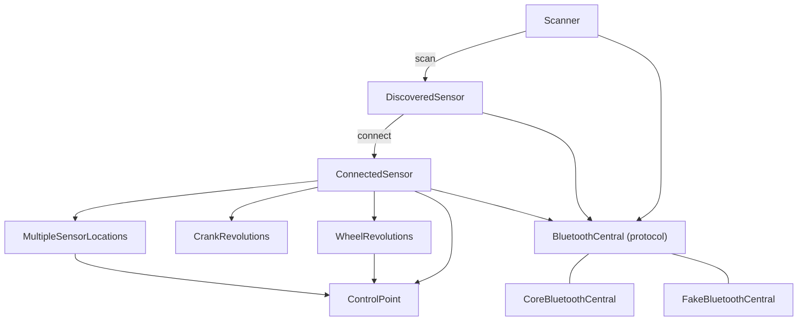

# CSCClient Architecture

> Agents (and humans) changing CSCClient's design — types, concurrency model, scan and connect
> lifecycle, measurement math, control-point gating, error mapping, or test seams — must update
> this file as part of that change.

This is a developer-facing overview for whoever maintains this code next. It describes design
and responsibilities, not an exhaustive member list — read the doc comments in source for API
detail, and `project.md` at the repo root for the behavioral contract this target implements
(that file is the authoritative spec; this file explains the shape of the code that satisfies
it).

## Purpose and scope

`CSCClient` implements the central (GATT client) side of the Bluetooth **Cycling Speed and
Cadence Service (CSCS)**: it scans for peripherals advertising `0x1816`, connects, reads CSC
Feature (`0x2A5C`) to decide wheel, crank, and location support, and exposes live speed, cadence,
and sensor-location operations. It does not implement the peripheral/server side — that is
`CSCServer`, a separate, independent product in this package. `CSCWire` (an internal, nonproduct
target) holds the shared wire codecs (`CSCMeasurement`, `CSCFeature`, `CSCControlPoint`,
`CSCSensorLocation`, GATT UUIDs) that both products depend on. Neither product depends on the
other.

The public surface is the scan/connect object graph (`Scanner`, `DiscoveredSensor`,
`ConnectedSensor`), the measurement types (`WheelRevolutions`, `CrankRevolutions`, `WheelSample`,
`CrankSample`, `Speed`, `Cadence`), location types (`SensorLocation`, `LocationSupport`,
`MultipleSensorLocations`), and the errors (`ConnectError`, `DisconnectError`,
`ControlPointError`). The CoreBluetooth adapter, the fake central, scan-session ids, the
connect-cancel state machine, and the control-point actor are `package` or internal so tests can
reach them without `@testable import`. They are not part of the product's public API.

Start Sensor Calibration (`0x02`) is not implemented. Wheel circumference is client-managed
(default 2.105 m, a 700×25C); the library does not read, write, or persist it on the sensor.

## Main types



- **`Scanner`** — a `Sendable` struct. `scan()` returns an `AsyncStream` of `DiscoveredSensor`.
  The public initializer builds a `CoreBluetoothCentral`. Tests use the `package` initializer to
  inject a `BluetoothCentral` and a `Timeouts` value. Creating the production central is what
  can raise the iOS Bluetooth permission prompt.
- **`Timeouts`** (`package`) — the three deadlines: 2 seconds for Bluetooth to leave `.unknown`
  / `.resetting` before a scan finishes empty, 10 seconds for the link to come up, and 30
  seconds for one SC Control Point procedure. Tests pass shorter values.
- **`DiscoveredSensor`** — id, name, and manufacturer from one discovery. `connect()` is the
  only way to obtain a `ConnectedSensor`. Initializers are internal or `package`; there is no
  public `CBPeripheral` initializer. The sensor retains the central that discovered it, so
  connect still works if the caller has dropped the `Scanner`.
- **`ConnectedSensor`** — one link. `revolutions` is `.wheel`, `.crank`, or `.wheelAndCrank`.
  `location` is `.unavailable`, `.fixed`, or `.multiple`. Support is fixed from CSC Feature at
  connect time; advertisement flags are not a fallback. A measurement task filters the central's
  shared event stream down to this peripheral's CSC Measurement notifications.
- **`WheelRevolutions` / `CrankRevolutions`** — lock-protected baselines plus
  `StreamBroadcaster` streams for instantaneous speed or cadence and for per-interval samples.
  Wheel also holds the optional `ControlPoint` used by Set Cumulative Value.
- **`ControlPoint`** (`package` actor) — one SC Control Point procedure at a time: write the
  request, wait for the indication or the deadline, ignore stale completions via a procedure id.
- **`SensorLocation`** — not publicly constructible. `kind` is the GATT assigned number
  (0...16, or `reserved` for anything else) and `displayName` is the UI label.
  `MultipleSensorLocations.update(_:)` writes Update Sensor Location and stores `current` only
  after the indication succeeds.
- **`BluetoothCentral`** (`Central/`) — the protocol seam. **`CoreBluetoothCentral`** is the
  production actor (`canImport(CoreBluetooth)`). **`FakeBluetoothCentral`** is the deterministic
  test double. Both publish power, discoveries, and GATT events through `StreamBroadcaster`
  streams that do not replay.
- **`ScanSessionID`** — a process-wide monotonic `UInt64` under an `NSLock`. Each `scan()` takes
  one. The central uses it so a stop and a start that race across tasks can be ordered.
- **`ConnectCancelCoordinator`** — the pure state machine for "the connect waiter was cancelled,
  but the radio has not finished dropping the link." `CoreBluetoothCentral` is the only caller.
  The fake does not simulate it; unit tests construct the coordinator directly.
- **`BluetoothCentralConnectErrorMapping`** — `BluetoothCentralError` to `ConnectError` for the
  connect path and the feature read.
- **`RevolutionBaseline`** — wrapping CSC cumulative-count and last-event-time delta. The first
  sample, a zero event-time delta, and `reset()` seed or advance the baseline without producing
  an interval.
- **`StreamBroadcaster`** — multicast `AsyncStream` fan-out. `finish()` ends current subscribers
  and makes a later `makeStream()` return an already-finished stream.

## Concurrency and isolation model

Three actors own the mutable protocol state: `CoreBluetoothCentral` (or `FakeBluetoothCentral`),
`ControlPoint`, and every `StreamBroadcaster`. `Scanner`, `DiscoveredSensor`, and the value types
are `Sendable` and hold no mutable shared state of their own.

Two long-running unstructured tasks sit beside those actors:

- `Scanner.scan()` runs its power wait, discovery loop, and dedupe inside the stream's task.
  Cancelling the stream cancels that task. `onTermination` cannot await, so `stopScanning` is
  scheduled on a detached task. The session id makes a late stop safe.
- `ConnectedSensor` runs one measurement loop task. `deinit` can only cancel that task. It
  cannot await `disconnect()`, so releasing a connected sensor finishes measurement streams and
  leaves the radio link up until someone calls `disconnect()`.

CoreBluetooth delegate callbacks arrive on `CoreBluetoothCentral`'s serial queue
(`com.bluetoothbikesensor.central`), not on the actor. `CentralDelegateBridge` (a lock-protected
`NSObject`) retains discovered `CBPeripheral`s and yields `Sendable` events onto one FIFO stream.
One task drains that stream into `handle(_:)`, which is the only place that mutates connection
bookkeeping and the only place that yields to the three broadcasters. That is what preserves
callback order. Manager and peripheral calls run inside `queue.sync` from actor methods. The
actor is blocked for the duration, and the serial queue cannot deliver another callback until
`sync` returns, so a command and a callback do not interleave.

`deinit` of the central finishes the delegate stream and does not call `queue.sync` (that could
block teardown on the manager queue) and does not resume in-flight continuations. A discovered
or connected sensor retains the central for the lifetime of an in-flight connect or GATT call.

`WheelRevolutions`, `CrankRevolutions`, and `MultipleSensorLocations` are `Sendable` classes, not
actors. Circumference, baselines, and `current` location are `nonisolated(unsafe)` and guarded by
an `NSLock`, because the measurement loop and arbitrary caller threads both touch them, and the
lock must not be held across a `StreamBroadcaster` or `ControlPoint` await. `ScanSessionID` uses
the same lock pattern for a different reason: `issue()` runs outside the central actor, before
`startScanning` / `stopScanning`.

`stateUpdates`, `discoveries`, and `events` do not replay. Callers subscribe before the action
that produces events. `stateSubscriptionSnapshot()` subscribes and then reads `currentState`
with no further await on the central, so a power transition is either already in the returned
state or still queued on the new stream. `events` is one stream for every peripheral on that
central. The measurement loop and each control-point listener filter it.

Within `ControlPoint`, the listener, the timeout, and the write are separate tasks, but the
actor runs their bodies one at a time. The interesting interleavings are at `await` points: a
timeout resuming the waiter while `writeInFlight` is still true, or a previous write's
completion arriving after the next `perform` has already bumped the procedure id.

## Lifecycle

### Scan

`Scanner.scan()` → `ScanSessionID.issue()` → a task:

1. `waitForPoweredOn`. `.poweredOn` continues immediately. `.unsupported`, `.unauthorized`, and
   `.poweredOff` finish the stream immediately (a denied permission prompt stays `.unauthorized`
   and is not waited out). `.unknown` and `.resetting` race state updates against the 2-second
   deadline. The sleep side rechecks `currentState`, so a transition that lands as the deadline
   fires still counts. The permission prompt often outlasts this wait; the caller retries
   `scan()` after the user answers. This is intentionally unlike `CSCServer`, which waits
   through `.unknown` with no deadline.
2. If the stream was cancelled during that wait, or while subscribing to `discoveries`, return
   without `startScanning`. `onTermination` has already recorded this session as stopped, so a
   start that loses the race never turns the radio on.
3. Subscribe to `discoveries`, then `startScanning` for `0x1816`. The production central
   disallows duplicate discoveries; iOS may also coalesce background discoveries. The extra
   `matchesCSCScan` filter keeps an advertisement that omits service UUIDs (background delivery
   does this) and drops one that lists services and does not include CSCS.
4. Yield each peripheral id at most once per session. A later `scan()` can yield it again.
   Manufacturer name is a small company-id table over the first two little-endian bytes of
   Manufacturer Specific Data. Any other id is `nil`.

`startScanning` / `stopScanning` on the central compare session ids. `stopScanning` always
records the highest stopped id, and stops the radio only when that id is the active scan. A
newer `startScanning` replaces `activeScanSession`. On the production central,
`scanForPeripherals` replaces the radio scan. The older session's later stop no longer matches
`activeScanSession`, so it does not turn the radio off. Turning Bluetooth off during a scan
does not finish the stream. Cancel the stream to stop.

Several `Scanner` values are independent: each public `Scanner()` has its own central. Two
`scan()` calls on one central (one scanner used twice, or a test sharing a fake) share that
central, and each gets its own discovery subscription.

### Connect

`DiscoveredSensor.connect()`:

1. If `currentState` is anything other than `.poweredOn`, throw `ConnectError.notPoweredOn`.
   Connect does not wait for power.
2. Race `BluetoothCentral.connect` against the 10-second deadline. The first result wins and
   the other task is cancelled. `ConnectError.timeout` cancels the connect task. The production
   central's cancellation handler schedules `cancelConnect` on the actor. That method resumes
   the connect continuation with `CancellationError` and, if the peripheral is not already
   `.disconnected`, calls `cancelPeripheralConnection` and sets the cancel-pending flag.
   Cancelling the caller is not `.timeout`. It surfaces as `ConnectError.failed` once that
   `CancellationError` is described.
3. `ConnectedSensor`'s initializer discovers the CSC service and the four characteristic UUIDs,
   reads CSC Feature, enables control-point indications when that characteristic exists, resolves
   location, subscribes to `events`, enables measurement notifications, then starts the
   measurement loop. Subscribing before enabling notifications matters because `events` does not
   replay; the stream buffers until the loop iterates.
4. If setup throws after the link is up, `connect()` disconnects and then throws, so a failed
   connect does not leave the peripheral connected.

A missing SC Control Point does not fail connect when the multiple-locations bit is clear.
Set Cumulative Value then throws `ControlPointError.controlPointUnavailable`. Multiple locations
still require Sensor Location and SC Control Point, and fail connect with
`ConnectError.serviceDiscoveryFailed` when either is missing, when the current location byte
does not decode, or when that current location is not in the supported list returned by Request
Supported Sensor Locations. A control-point failure during that connect-time procedure is mapped
into `ConnectError`, not left as `ControlPointError`.

Feature bits select `.wheel`, `.crank`, or `.wheelAndCrank`. Neither wheel nor crank fails
connect. Without the multiple-locations bit, a present Sensor Location characteristic is
`.fixed`; a missing one is `.unavailable`.

### Connected

The measurement loop keeps this peripheral's CSC Measurement values and ignores everything else
on the shared `events` stream, including other peripherals and control-point indications. An
unexpected `.disconnected` for this id finishes the speed, cadence, and sample streams and
returns. It does not throw. `DisconnectError` is only produced by an explicit `disconnect()`
that fails.

`disconnect()` cancels the loop and finishes those streams before it touches the radio, so
consumers unblock even when notify teardown is slow. Disabling notifications is best-effort.
A peripheral the central has already dropped makes `disconnect()` throw
`DisconnectError.alreadyDisconnected`. A peripheral that is already `.disconnected` but still
known is success, and the production central does not emit another `.disconnected` event for
that call. The returned `DiscoveredSensor` is the one `connect()` was given, so the caller can
connect again.

### Bluetooth power after connect

Leaving `.poweredOn` for `.poweredOff`, `.resetting`, `.unauthorized`, or `.unsupported` clears
every cancel-pending id and fails in-flight connects with `BluetoothCentralError.notPoweredOn`.
Other in-flight GATT requests are left for their own callbacks or a later disconnect.
`.unknown` does not fail connects. There is no public Bluetooth-power API and no automatic
reconnect. Apps that need to distinguish "unauthorized" from "off" check
`CBManager.authorization` themselves.

## Data flow: measurements

```mermaid
sequenceDiagram
    participant CB as BluetoothCentral
    participant Loop as Measurement loop
    participant Wheel as WheelRevolutions
    participant Streams as StreamBroadcaster

    CB->>Loop: valueUpdated for this id, CSC Measurement
    Loop->>Loop: decode CSCMeasurement
    Loop->>Wheel: receive revolutions and event time
    Wheel->>Wheel: baseline delta and circumference under lock
    Wheel->>Streams: yield speed, then wheel sample
```

`RevolutionBaseline` stores the previous cumulative count and last-event time. The first sample
only seeds it. Later samples use wrapping subtraction. Event time is `UInt16` at 1/1024 second
and wraps every 64 seconds, so a silent gap longer than that looks like a short interval. One
revolution across that short interval is still under the speed cap, and a sample is emitted with
that short `deltaTime`. The library does not reconstruct wall-clock time. A zero event-time
delta emits nothing and still advances the baseline, so the next interval starts at the
duplicate.

`WheelRevolutions.sample` drops an implied speed above 50 m/s (exactly 50 is kept).
`CrankRevolutions.sample` drops an implied cadence above 300 rpm (exactly 300 is kept). The
baseline has already moved before that drop, so the next interval starts at the rejected sample.
A positive event-time delta with zero new revolutions is emitted as 0 m/s or 0 rpm.

Wheel distance and speed use `wheelCircumference` as it was under the lock when the sample was
built. Speed is yielded in meters per second, then the `WheelSample`. Cadence is yielded in
revolutions per minute (`UnitFrequency.revolutionsPerMinute`, linear coefficient 1/60), then the
`CrankSample`. Streams do not replay. A payload that fails to decode is dropped.

`setCumulativeRevolutions(_:)` resets the wheel baseline only after the control-point procedure
succeeds, so the next measurement seeds a new interval. The reset is after that await. A
measurement processed before the reset still uses the previous baseline.

## Data flow: SC Control Point

`ControlPoint.perform` is the only procedure runner. Set Cumulative Value and Update Sensor
Location (and Request Supported Sensor Locations during connect) all go through it.

1. If `isBusy` is set, throw `ControlPointError.procedureInProgress` without writing.
2. Bump `procedure` (wrapping add) and capture it. Subscribe to `events` before the write.
3. Arm a listener and a timeout task, set `writeInFlight`, and write the request with response.
4. The listener resolves on this peripheral's control-point indication, or fails the procedure
   on this peripheral's disconnect. Measurement traffic on the same stream is ignored.
5. `resolve` ignores a stale procedure id. That drops an indication that shows up after
   `.timedOut`, so the next procedure cannot consume it.
6. Success clears `isBusy` even if the write call has not returned. The next `perform` may
   start. The previous write's later completion sees a mismatched id and does not clear the new
   procedure's `writeInFlight`.
7. Failure clears `isBusy` only when the write has already finished. A timeout while the write
   is stuck resumes the caller with `.timedOut` and leaves `isBusy` set, so the next `perform`
   throws `.procedureInProgress` until `writeFinished` for that same id runs.
8. The indication is checked for the request opcode and the CSCS response value. `0x80` / `0x81`
   can also arrive as ATT application errors on the write itself, mapped to `.procedureInProgress`
   and `.cccdImproperlyConfigured`.

`waitUntilIdle()` is the test hook that parks until both `isBusy` and `writeInFlight` are false.
`MultipleSensorLocations.controlPoint` is `package` so tests can call it after a timeout.

Update Sensor Location checks `supported` before writing. `current` changes only after success.
A timeout leaves the previous location in place even if a late indication arrives afterward.

## Error handling

Public errors stay small. Diagnostic `reason` strings are for logs and tests. They are not
user-facing copy; the app maps the case to its own message.

| Source | Public error |
|---|---|
| Connect while state is not `.poweredOn` | `ConnectError.notPoweredOn` |
| Connect deadline | `ConnectError.timeout` (the link cancel still runs) |
| Caller cancelled connect, or a central failure with a reason string | `ConnectError.failed` |
| Unknown peripheral at connect | `ConnectError.peripheralNotFound` |
| Bad feature, missing required characteristic, location setup, connect-time control point | `ConnectError.serviceDiscoveryFailed` |
| `BluetoothCentralError.disconnected` during connect | `ConnectError.failed`, reason `"Disconnected during connect"` when the central reason is nil |
| Disconnect of an unknown peripheral | `DisconnectError.alreadyDisconnected` |
| Any other disconnect failure | `DisconnectError.failed` |
| Unexpected link loss while connected | no error; measurement streams finish |
| Set Cumulative Value with no control point | `ControlPointError.controlPointUnavailable` |
| Second procedure while `isBusy` | `ControlPointError.procedureInProgress` |
| Indication response or ATT `0x80` / `0x81` | the matching `ControlPointError` case |
| Procedure deadline | `ControlPointError.timedOut` |
| `CancellationError` inside a procedure | `ControlPointError.failed` with reason `"Cancelled"` |

`CoreBluetoothCentral` keeps ATT write failures in the ATT domain as `attApplicationError`
when the code fits in `UInt8`. Other delegate failures are stored as reason text on the event.
A `didFailToConnect` or `didDisconnect` whose peripheral is still `.connected`, and whose id is
not pending cancel, is ignored so a stale callback cannot tear down a live link.

`BluetoothCentralError.connectionFailed` with reason `"Request already in progress"` means a
second call reused a `Request` key that still has a continuation. Connect, disconnect, and the
two discovery calls are keyed by peripheral only. Read, write, and set-notify also include the
service and characteristic.

## Test seams and test organization

Tests live in `Tests/CSCClientTests`, with `Internal/` for `ConnectCancelCoordinator` and
`RevolutionBaseline`, and `Support/` for shared fake helpers. Tests use `import CSCClient` —
never `@testable import` — and reach test-only surface through `package` visibility.

- **`FakeBluetoothCentral`** replaces `CoreBluetoothCentral` in tests. It records calls, can
  fail the next operation, and can park connect, write, and set-notify so tests can force
  timeouts and overlap without real Bluetooth timing. Scan-session ids match production. The
  fake does not model cancel-pending, the powered-on check inside `connect`, or the
  already-connected short circuit. `disconnect` on the fake yields `.disconnected` even when
  the id was not connected; production returns early and does not yield. `waitUntil(_:)` is the
  single generic park, same idea as the server fake.
- **`Timeouts`** on `Scanner.init(central:timeouts:)` shortens the 2-second, 10-second, and
  30-second deadlines so tests do not sleep for the production budgets.
- **`ConnectCancelCoordinator`** is tested as a value. The production central is the
  integration; there is no CoreBluetooth-backed unit test of `cancelConnect`.
- **`WheelRevolutions.sample` / `CrankRevolutions.sample`** and **`RevolutionBaseline`** are
  `package` so the caps and the wrap math can be checked without a central.
- **`MultipleSensorLocations.controlPoint`** exposes `waitUntilIdle()` for tests that time out
  a procedure while its write is still outstanding.

Tests are grouped by the public type they drive (`Scanner`, `DiscoveredSensor`,
`ConnectedSensor`, wheel, crank, location, control point). A connect test still runs
`ConnectedSensor`'s setup and, for multiple locations, `ControlPoint`.

## Nonobvious design decisions

- **A scan session id, not a scanning bool.** `stopScanning` and `startScanning` are different
  tasks and can run in either order. The highest stopped id is recorded even when it is not the
  active scan, so a start that has not run yet stays off, and a stale stop cannot cancel a
  newer session.
- **The scan power wait is short.** Two seconds covers a radio that is `.unknown` or
  `.resetting` for a moment. It does not cover a user reading the permission prompt. Finishing
  the stream empty is the signal to call `scan()` again. Waiting forever would make a denied
  or ignored prompt look like a hung scan.
- **Connect cancellation and radio teardown are separate.** The waiter is failed as soon as the
  connect task is cancelled, including on timeout. `ConnectCancelCoordinator` stays set until
  the peripheral is actually `.disconnected`. While it is set, `didConnect` cancels the link
  again, and a replacement `connect` does not call `CBCentralManager.connect` until teardown
  clears the flag. `.connecting` and `.disconnecting` are not terminal, so they do not clear it.
- **One event stream per central, filtered by consumers.** Multiple connections share a
  central. Splitting streams inside the central would duplicate the fan-out `StreamBroadcaster`
  already provides. Each loop and each procedure keeps only its peripheral and characteristic.
- **Subscribe before the producing call.** Discoveries before `startScanning`, `events` before
  measurement notifications, control-point `events` before the procedure write. None of those
  streams replay.
- **`isBusy` outlives a timeout that raced the write.** Otherwise the next procedure could write
  while the timed-out write was still in flight. Success is the opposite: `isBusy` drops when
  the indication arrives, and the procedure id protects the next procedure from the old write's
  completion.
- **The baseline moves even when the sample is dropped.** The cap exists to ignore a corrupt or
  wildly wrapped interval. Keeping that sample as the new seed stops the next notification from
  repeating the same bad delta.
- **Feature bits and the characteristic list are fixed at connect.** Changing what the sensor
  exposes means disconnecting and connecting again. The library does not watch Service Changed.
- **Releasing `ConnectedSensor` finishes streams and does not disconnect.** `deinit` cannot
  await the central. `disconnect()` is the call that drops the link and returns a sensor that
  can be connected again.
- **No public Bluetooth authorization error.** Unauthorized, unsupported, off, and still-unknown
  all become an empty scan or `ConnectError.notPoweredOn`. Folding authorization into the public
  enum would break exhaustive switches every time the platform adds a state. Apps read
  `CBManager.authorization` when they need the distinction.
