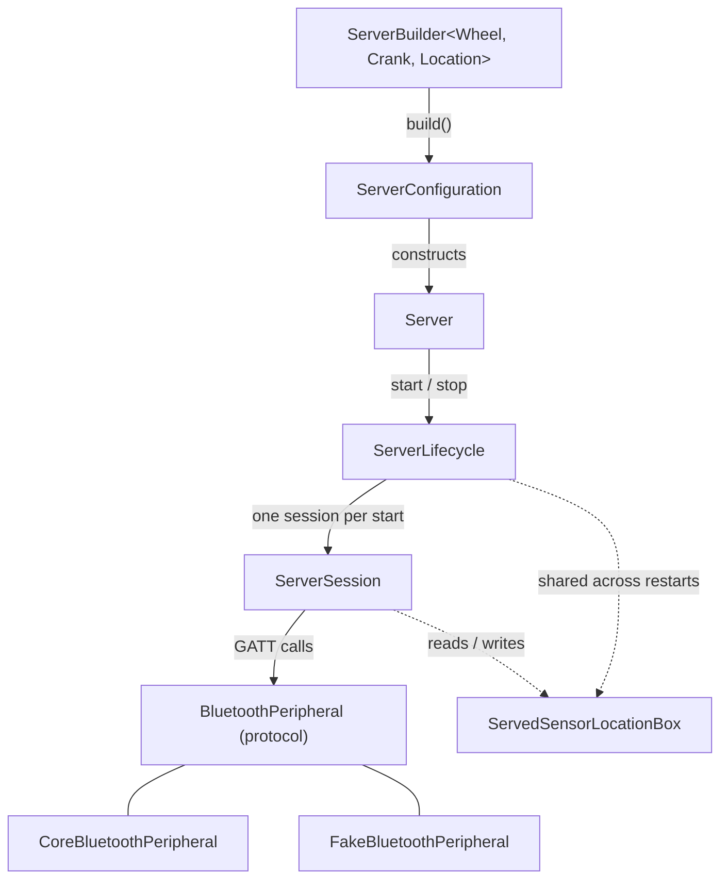
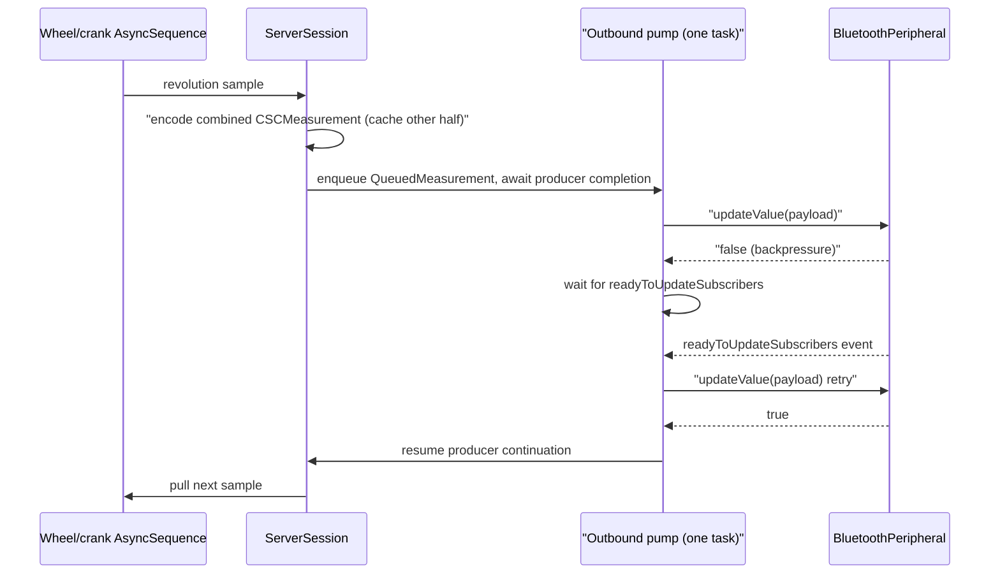

# CSCServer Architecture

> Agents (and humans) changing CSCServer's design — types, concurrency model, lifecycle, data
> flow, error handling, or test seams — must update this file as part of that change.

This is a developer-facing overview for whoever maintains this code next. It describes design
and responsibilities, not an exhaustive member list — read the doc comments in source for API
detail, and `project.md` at the repo root for the behavioral contract this target implements
(that file is the authoritative spec; this file explains the shape of the code that satisfies
it).

## Purpose and scope

`CSCServer` implements the peripheral (GATT server) side of the Bluetooth **Cycling Speed and
Cadence Service (CSCS)**: it advertises `0x1816`, serves CSC Measurement notifications from
caller-supplied wheel/crank revolution sources, and handles the SC Control Point procedures
(Set Cumulative Value, Update Sensor Location, Request Supported Sensor Locations). It does not
implement the central/client side — that is `CSCClient`, a separate, independent product in this
package. `CSCWire` (an internal, nonproduct target) holds the shared wire codecs (`CSCMeasurement`,
`CSCFeature`, `CSCControlPoint`, `CSCSensorLocation`, GATT UUIDs) that both `CSCServer` and
`CSCClient` depend on.

The public surface is intentionally small: a type-state `ServerBuilder` that produces a `Server`,
two delegate protocols (`CumulativeWheelRevolutionsDelegate`, `MultipleSensorLocationsDelegate`)
for the two control-point procedures that need caller input, and a handful of small value types
(`WheelRevolution`, `CrankRevolution`, `SensorLocationKind`, `ServerError`). Everything else —
the CoreBluetooth adapter, the session state machine, the outbound pump — is `package`-visible
so tests can reach it without `@testable import`, but is not part of the product's public API.

## Main types

- **`ServerBuilder`** — a type-state builder (`ServerWheel`/`ServerCrank`/`ServerLocation`
  marker generics) that pushes "static and multiple locations are mutually exclusive" to compile
  time. "At least one revolution source" is *not* type-state enforced: `build()` has no
  constraint requiring wheel or crank to be selected, and the underlying requirement is a runtime
  `precondition` inside `ServerConfiguration`'s initializer instead.
- **`ServerConfiguration`** (`Internal/`) — the one place that turns a finished builder
  configuration into the pieces a `Server` needs: computes the CSC Feature bits and the fixed
  characteristic inventory. Everything decided here is fixed for that `Server`'s lifetime —
  feature bits and the characteristic list never change across `stop()`/`start()` or Bluetooth
  recovery.
- **`Server`** — the public, `Sendable` handle apps hold. It has no public initializer; owns a
  `ServerLifecycle`; forwards `start()`/`stop()`/`measurementSubscriberCount` to it. Releasing a
  started `Server` schedules `stop()` in the background from `deinit`, so leaking a reference
  doesn't leak Bluetooth resources. Separate `Server` instances are fully independent — there is
  no process-wide "one server" limit.
- **`ServerLifecycle`** (`Internal/`) — an actor owning one `Server`'s start/stop **state
  machine** (`idle → starting → running → stopping → idle`). It creates a fresh `ServerSession`
  on every `start()` and discards it on `stop()` — sessions are not reused. It also republishes
  `measurementSubscriberCount` (forced to `0` while not `.running`) so callers never see a stale
  count from a discarded session.
- **`ServerSession`** (`Internal/`) — an actor that does essentially all of the real work for one
  start-to-stop lifetime: the inbound event loop, the outbound notify/indicate pump, SC Control
  Point procedure execution, and Bluetooth suspend/recovery. This is the largest and most
  intricate file in the target; see the doc comments on its private state for the invariants each
  piece of state protects.
- **`BluetoothPeripheral`** (`Peripheral/`) — the protocol seam between session logic and the
  Bluetooth stack. **`CoreBluetoothPeripheral`** is the production conformer (built only where
  `canImport(CoreBluetooth)`); **`FakeBluetoothPeripheral`** is the deterministic test double.
  Both funnel every inbound signal (power state, reads, writes, CCCD changes, ready-to-update)
  through one ordered `events: AsyncStream<PeripheralEvent>`.
- **`ServedSensorLocationBox`** (`Internal/`) — a small lock-protected box (not an actor) holding
  the byte currently served on Sensor Location for a multiple-location build. It is created once
  by `ServerLifecycle` and handed to every `ServerSession` across restarts, because the served
  location must survive session recreation even though nothing else about a session does.
- **`ServerTestCondition`** — an enum of internal states test code can block on via a single
  generic `waitUntil(_:)` on `Server`/`ServerLifecycle`/`ServerSession`, replacing what would
  otherwise be a dozen bespoke wait methods.
- **`AnyAsyncSequence`** and **`StreamBroadcaster`** (`Internal/`) are small utilities: the former
  type-erases caller-supplied revolution sequences (including ones with non-`Sendable`
  iterators, boxed and iterated from exactly one task); the latter is a generic multicast
  `AsyncStream` fan-out used by both peripheral implementations and by `ServerLifecycle`'s
  subscriber-count stream.

## Concurrency and isolation model

Almost everything is an **actor**, and almost every cross-boundary interaction is `async`. The
actors involved are: `ServerLifecycle`, `ServerSession`, `CoreBluetoothPeripheral`,
`FakeBluetoothPeripheral`, and `StreamBroadcaster`. Each actor's private state is only ever
touched from within that actor; there is no locking inside them.

Two things sit outside actor isolation on purpose, and both exist for the same reason —
`deinit` cannot `await`:

- **`StartupAsyncContinuations`** (inside `CoreBluetoothPeripheral`) holds the single in-flight
  `add`/`startAdvertising` continuation behind an `NSLock`, so `deinit` can fail it synchronously
  without hopping onto the actor.
- **`ServedSensorLocationBox`** is a plain lock-protected class, not an actor, because
  `ServerSession.readResponse(for:)` needs to read it synchronously while answering a GATT read,
  and it must be shared, by reference, between `ServerLifecycle` (which creates it) and every
  `ServerSession` (which reads and writes it) — two different actors.

CoreBluetooth delegate callbacks arrive on `CoreBluetoothPeripheral`'s own serial
`DispatchQueue` (`com.bluetoothbikesensor.peripheral`), not on any Swift actor.
`PeripheralDelegateBridge` (a plain, lock-protected `NSObject`) captures each callback and feeds
it into a single FIFO channel that one task drains onto the actor — this is what guarantees
callback order is preserved once it reaches `events`. All direct `CBPeripheralManager` calls run
inside `queue.sync` from actor methods; the actor is the only caller of those methods.

Within `ServerSession`, several independent long-running `Task`s exist side by side — the inbound
event loop, the outbound pump, the wheel loop, the crank loop, and (while a control-point write is
being handled) a procedure task — but because `ServerSession` is an actor, their bodies still
execute one at a time with respect to the session's state. Concurrency comes from *interleaving*
at `await` points, not from true parallel mutation. Understanding an invariant in this file
usually means asking "what can happen at the other end of this specific `await`?" (a Set
Cumulative Value procedure bumping `wheelGeneration` while the outbound pump is suspended inside
an `updateValue` call is a recurring example — see `recordAcceptedMeasurement(_:)`).

## Lifecycle

### Build

`ServerBuilder.build()` fixes the CSC Feature bits and the characteristic inventory for the
`Server`'s entire lifetime, including across every future `stop()`/`start()` and Bluetooth
recovery cycle. There is no way to add or remove a characteristic after `build()`; the only way to
change what a server advertises is to build a new one.

### Start

`Server.start()` → `ServerLifecycle.start(peripheral:clock:)`:

1. Guard that this `Server`'s own `phase` is `.idle` — a second `start()` on the same instance
   throws `.alreadyStarted`, but a different `Server` instance is unaffected; multiple servers
   may be starting or running at once.
2. Spawn a child task running `ServerSession.open(...)`, which:
   - waits for Bluetooth to leave `.unknown`/`.resetting` (this is where the iOS permission
     prompt is waited out);
   - subscribes to `events` **before** calling `add`/`startAdvertising` (the stream does not
     replay, so subscribing late would lose events);
   - publishes the GATT service, then starts advertising;
   - rechecks that the power-loss counter hasn't changed since the wait — if Bluetooth dropped
     and came back mid-startup, startup still fails with `.notPoweredOn`;
   - drains any inbound events that arrived while starting (buffered, not dropped) in arrival
     order, then opens the "startup gate" so future events are handled live;
   - starts the wheel/crank pull loops.
3. Back in `ServerLifecycle`, once the child task finishes, reverify it is still the task `phase`
   points at before committing to `.running` — a concurrent `stop()` may have already begun
   tearing this same task down.

`start()` returns once advertising has actually started. Cancelling the calling task, or any
failure at any step, rolls the partial startup back (removes the service if it was added, stops
advertising if it was started) before the error propagates.

### Advertising and subscriptions

Once running, centrals discover the service, connect, and subscribe to CSC Measurement (and, for
builds with SC Control Point, to the control point characteristic for indications). Subscription
changes arrive as `.subscription` events on the same ordered `events` stream as everything else.
`measurementSubscriberCount` reflects the live measurement-subscriber set while running, and is
forced to `0` whenever the server is not `.running` (starting, stopped, or radio-suspended).

### Stop

`Server.stop()` is idempotent. If nothing is running, it's a no-op. If startup is still in
progress, it cancels that task and, if a session had already been produced before the
cancellation was observed, closes that session too. If a session is running, it closes it:
cancels the outbound pump / procedure / wheel / crank tasks and waits for them, stops advertising,
removes the service, then stops consuming inbound events. A second concurrent `stop()` joins the
same in-flight teardown task rather than starting a second one.

### Bluetooth loss and recovery

While running, any `BluetoothState` other than `.poweredOn` suspends the session: it drops both
subscriber sets (so measurement and control-point traffic stops), lets the outbound pump discard
whatever is queued, and keeps pulling from the wheel/crank sources (samples are simply dropped
since nobody is subscribed) — but does **not** unpublish the service. When the state transitions
back into `.poweredOn` (a genuine transition, not a duplicate event), recovery republishes the
exact build-time service and starts advertising again from scratch; centrals must reconnect and
resubscribe. A failed recovery attempt leaves the server suspended, without throwing, and simply
retries on the next loss-then-regain cycle.

## Data flow: measurements

Each wheel/crank `AsyncSequence` is pulled by its own dedicated task (`startRevolutionLoop`), one
iterator per source, never shared across tasks. Every sample is combined with the *last accepted*
sample from the other source (cached in `wheelCache`/`crankCache`) into one CSC Measurement
payload, then handed to the single outbound pump and — critically — **the producing loop awaits
until that item leaves the queue** before pulling the next sample. This is the backpressure
mechanism for the whole pipeline: a slow CoreBluetooth transmit queue throttles the wheel/crank
loops themselves, not just the pump.

The pump is the **only** caller of `updateValue` and the only remover of the queue head. When
`updateValue` returns `false` (CoreBluetooth's transmit buffer is full), the pump parks on a
ready-to-update latch and retries the exact same payload once `events` reports
`.readyToUpdateSubscribers`. `prepareHead(_:)` rechecks, both before the first send attempt and
again after every `false` return, the three reasons the head might no longer be sendable:

- **Shutdown or no subscribers**: the item is dropped and its producer resumed.
- **Staleness**: a queued wheel-bearing payload is stamped with the `wheelGeneration` it was
  encoded against. If a Set Cumulative Value procedure completes while that payload is still
  queued (or even mid-flight, suspended inside `updateValue`), the payload is recognized as stale
  and reencoded (crank-only, if there's a crank half) or dropped, rather than sent with a
  now-wrong wheel cumulative.

**Radio loss during a send** is checked separately, only on acceptance: if Bluetooth drops while a
`updateValue` call for a measurement is in flight, an eventual `true` return is not trusted — it
reached no *current* subscriber — so it is not cached and does not count as accepted.

An empty measurement-subscriber set drops a sample immediately rather than queuing it.

## Data flow: SC Control Point

Requests and responses use the same outbound queue and pump as measurements, but as
**indications** (not notifications) to the specific central that wrote the request:

1. A write to the control point characteristic is classified in a fixed order (service/
   characteristic gate → offset → decode → CCCD subscribed → no procedure already running) before
   anything else runs. Only one procedure runs at a time.
2. The write is ATT-acknowledged immediately (`respond(... .success ...)`), then a 30-second
   timeout is armed — CSCS §3.4.4 requires bounding procedure duration, and CoreBluetooth never
   reports the ATT confirmation for an indication, so this budget is the server's own substitute.
3. The actual procedure (Set Cumulative Value, Update Sensor Location, or Request Supported
   Sensor Locations) runs on its own task, possibly calling a caller-supplied delegate. Delegates
   must honor cancellation — `stop()` and the timeout both cancel an in-flight call.
   `runProcedure(_:centralID:)` dispatches by matching `(request, wheel config, multiple-location
   config)` together, so a request this build does not serve falls through to a generic
   "unsupported/invalid" case instead of running.
4. On success, the procedure's indication is enqueued (`enqueueIndication`) and processed by the
   same pump used for measurements — including the same retry-on-`false` backpressure loop.
   `enqueueIndication` itself checks `closed`/timed-out and ends the procedure without indicating
   if either is true, so call sites do not need a separate check before indicating. Because the
   pump may be suspended mid-retry when something else (unsubscribe, timeout, another radio loss)
   removes or ends the owning procedure, every reentry point revalidates that this exact item
   (matched by a stable id) is still the one being processed before acting on it again.
5. A delegate call that returns successfully *after* the timeout has still applied its side effect
   (the new value is stored / the cumulative delegate ran), but no indication is sent — the spec
   assumes the peer will retry, and retries must be safe to apply again.

Set Cumulative Value bumps `wheelGeneration` (invalidating queued wheel data, see above) and wakes
a parked pump directly, without pretending a real CoreBluetooth ready signal arrived — the
distinction between "wake to recheck something" and "a real ready-to-update signal happened" is
deliberate: `resumeReadyToUpdateWaiter()` only wakes an already-parked waiter, while
`signalReadyToUpdate()` (the real CoreBluetooth callback) also arms the latch for a future wait.

## Error handling and recovery

- **Startup failures** (`ServerError.notPoweredOn`, `.publishFailed`, `.advertisingFailed`,
  `.alreadyStarted`) always roll back whatever partial state was published before propagating.
- **Running-session Bluetooth loss** is not surfaced as an error at all — there is no public
  Bluetooth-power API. The server suspends and recovers automatically; apps observe the effect
  (subscriber count dropping to zero) rather than the cause. Apps needing to distinguish
  "unauthorized" from "temporarily off" check `CBManager.authorization` directly, since folding
  that into `ServerError` would break exhaustive switches over a nonfrozen public enum.
- **Delegate failures** during a control-point procedure indicate `operationFailed`.
- **CoreBluetooth-level errors** (`BluetoothPeripheralError`) are mapped to the smaller public
  `ServerError` surface at the two places startup can fail (`add`, `startAdvertising`); the same
  underlying error can map to `.publishFailed` or `.advertisingFailed` depending on which call
  failed (`ServerSession.serverError(from:during:)`).

## Test seams and test organization

Tests live in `Tests/CSCServerTests`, mirroring the `Sources/CSCServer` layout (`Peripheral/` and
`Internal/` subfolders for those types' tests, plus a `Support/` folder of shared fakes and
scripted delegates). Tests use `import CSCServer` — never `@testable import` — and reach
test-only surface through `package` visibility instead. Key seams:

- **`FakeBluetoothPeripheral`** replaces `CoreBluetoothPeripheral` entirely in tests, so tests run
  without real Bluetooth hardware and without CoreBluetooth's own timing. It records every call
  (`recordedCalls`) and can deterministically hold specific calls (`hold(.add)`,
  `hold(.updateValue)`, …) and later release them, to force races that would otherwise be
  timing-dependent. A single generic `waitUntil(_ isMet:)` (backed by one `conditionWaiters` list
  of actor-isolated predicates) replaces what would otherwise be many bespoke wait methods.
- **`Server`'s `package` surface** (`start(peripheral:clock:)` plus `waitUntil(_:
  ServerTestCondition)`) lets tests inject the fake peripheral and a manual `ServerClock`
  (`Tests/.../Support/ManualServerClock.swift`) to control the 30-second procedure timeout without
  real sleeping. `ServerTestCondition` gives tests a fixed vocabulary of internal states to block
  on (a subscriber set, an outbound queue depth, a parked waiter) instead of polling or sleeping.
- **Scripted delegates and controlled sequences** in `Support/` (e.g. `ScriptedCumulativeDelegate`,
  `ScriptedLocationDelegate`, `ControlledWheelSequence`, `YieldingCrankSequence`) let tests script
  delegate responses (including artificial delays or parking to test cancellation) and control
  exactly when a revolution source yields, without relying on real time.

Tests are grouped roughly by concern (lifecycle, control point, procedure timeout, notify queue,
radio state, subscriber count, wheel/crank behavior, builder validation) rather than one-file-per-
source-file, because most interesting behavior spans several source files (a control-point test
exercises `ServerSession`'s write handling, the outbound pump, and often `ServerClock`).

## Nonobvious design decisions

- **A new `ServerSession` per `start()`**, rather than a reusable session, keeps all of the
  session's intricate state (queues, caches, generations, gates) trivially reset on restart —
  there is no "clear everything" method to keep in sync with new state as the session evolves.
- **The outbound pump is the sole `updateValue` caller** specifically so backpressure, staleness,
  and procedure-ownership checks live in one place (`prepareHead(_:)`) instead of being duplicated
  across every call site that might want to send something.
- **Notifications vs. indications share one queue and one pump** because they share the exact same
  backpressure problem (CoreBluetooth's transmit buffer) and the same "retry the same bytes on
  `false`" contract; splitting them would duplicate that retry logic for no benefit.
- **`wheelGeneration` staleness detection, not a lock, protects the wheel cache** because the
  cache is only ever touched from within the `ServerSession` actor — the problem being solved is
  not concurrent mutation, it's a value becoming outdated while sitting in a queue across an
  `await`.
- **Feature bits and the characteristic list are immutable after `build()`** because CoreBluetooth
  has no story for updating a published GATT database in place that this library relies on
  (`Service Changed` is not implemented); changing shape means publishing a new service and
  requiring centrals to rediscover it, so the library makes that the only path.
- **No process-wide "one server" limit.** Earlier revisions of this target serialized every
  `Server` through a single process-wide slot; that constraint has been removed. Each `Server`
  now owns an entirely independent `ServerLifecycle`, and multiple servers may start, run, and
  stop concurrently. If a future requirement reintroduces a shared-resource constraint (e.g. a
  hardware limitation), it belongs at this layer, not assumed away.
- **"At least one revolution source" is a runtime precondition, not a type-state guarantee.**
  `ServerBuilder.build()` is unconstrained by `Wheel`/`Crank`, unlike `staticSensorLocation`/
  `multipleSensorLocations`, which the type-state markers do make mutually exclusive at compile
  time. A caller that never selects wheel or crank data will not fail to compile; it will crash
  via `precondition` inside `ServerConfiguration.init` at `build()` time instead.
