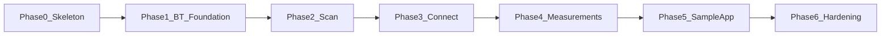

# Implementation Plan

## Goals / constraints

BluetoothBikeSensorSwift is a Swift package that scans for, connects to, and reads Bluetooth CSCS (Cycling Speed and Cadence Service) sensors. The deliverable includes:

- A **library** with a small, testable public API built around `Scanner`, `DiscoveredSensor`, and `ConnectedSensor`.
- An **iOS-only SwiftUI sample app** that demonstrates scanning, connecting, and reading live measurements.

Design constraints carried forward from [project.md](project.md):

- Follow SOLID principles and Swift concurrency idioms (`async`/`await`, `AsyncSequence`).
- `Scanner` is instantiable with dependency injection, not a singleton.
- Sensor types are obtained only through the library's factory flow (scan → connect → disconnect), not via public CoreBluetooth initializers.
- Wheel size for speed calculation is **client-managed**; the library does not persist wheel size.
- Each phase below defines **scope only**. Detailed design, task breakdown, and implementation for a given phase will be planned separately before that phase begins.

---

## Evaluation of project.md

### Is the project description reasonable?

**Yes.** The description defines a coherent product with a clear separation between library and sample app. The public API ladder is well structured:

```
Scanner.scan() → DiscoveredSensor → connect() → ConnectedSensor → disconnect() → DiscoveredSensor
```

Using `AsyncSequence` for scan results and live measurements is appropriate for Bluetooth event streams. Choosing an instantiable `Scanner` with initializer injection (over a singleton) supports testability and aligns with SOLID dependency-inversion goals. Restricting `DiscoveredSensor` and `ConnectedSensor` to internal initializers keeps CoreBluetooth details encapsulated.

The sample app scope—a single scan list with state-driven row content—is proportionate for demonstrating the library without overbuilding UI.

### Is the project description sufficient?

**Mostly sufficient to begin phased work**, but not sufficient to implement end-to-end without resolving several open items during future phase planning.

**What is well specified:**

- Core types and their relationships (`Scanner`, `DiscoveredSensor`, `ConnectedSensor`).
- Primary operations (`scan`, `connect`, `disconnect`) and return types.
- Discovery metadata fields (id, name, manufacturer, hasSpeed, hasCadence).
- Optional speed/cadence streams on `ConnectedSensor` using `Speed` (`Measurement<UnitSpeed>`) and `Cadence` (`Measurement<UnitFrequency>` with `UnitFrequency.revolutionsPerMinute`).
- Sample app screen structure and state-driven display (discovered vs connected).

**Gaps to address in future phase planning (not blockers for this roadmap):**

| Area | Gap |
|------|-----|
| Wheel size API | Exact surface for client-managed wheel size is unspecified (e.g., circumference passed when reading speed vs client computing from raw revs). |
| Errors | `ConnectError` and `DisconnectError` cases, Bluetooth power/authorization failures, and mid-stream disconnect behavior are unspecified. |
| Capability detection | Whether `hasSpeed` / `hasCadence` come from advertisement data, GATT service discovery, or both is unspecified. |
| Concurrency | Actor isolation, `Sendable` requirements, and thread-safety guarantees for public types are unspecified. |
| Multi-sensor | Whether multiple simultaneous connections are supported and how duplicate scan results are handled are unspecified. |
| Platform/tooling | Minimum iOS version, Swift tools version, and package vs Xcode project layout are unspecified. |
| Testing | Strategy for CoreBluetooth test doubles and what can run in CI vs on-device is unspecified. |
| Advertisement data | Name and manufacturer are often absent or incomplete in BLE advertisements; best-effort behavior needs definition. |
| Sample app UX | Resolved here: single list screen (see Locked decisions). |

These gaps do not invalidate [project.md](project.md); they are expected to be closed when planning individual phases.

---

## Locked decisions

Decisions resolved from [project.md](project.md) and project discussion:

1. **`Scanner` is instantiable** with dependencies passed through its initializer (not a singleton).
2. **`DiscoveredSensor` and `ConnectedSensor` have internal initializers only** — no public `CBPeripheral` initializers unless a clear use case emerges later.
3. **Wheel size is client-managed** — the client supplies wheel circumference (or equivalent) for speed calculation; the library does not read, write, or persist wheel size.
4. **Sample app is iOS-only**, built with SwiftUI.
5. **Sample app uses a single Scan list screen** — no separate sensor detail screen; row content is driven by a State Pattern for discovered vs connected states.
6. **`Speed` and `Cadence` are Foundation `Measurement` typealiases** — `Measurement<UnitSpeed>` and `Measurement<UnitFrequency>`; library provides `UnitFrequency.revolutionsPerMinute`.

---

## Open items for phase planning

The following will be decided when planning each phase, not in this document:

- Concrete definitions of `ConnectError` and `DisconnectError`.
- Exact client wheel-size integration point (property on `ConnectedSensor`, parameter to a speed stream factory, or exposure of raw CSC data for client-side computation).
- Minimum iOS deployment target and Swift package structure (single library target vs layered targets).
- CoreBluetooth abstraction boundaries and fake implementations for unit tests.
- Scan deduplication, re-discovery after disconnect, and multi-connection policy.
- `hasSpeed` / `hasCadence` detection strategy and fallback when advertisement data is incomplete.
- Behavior when Bluetooth is off, unauthorized, or interrupted mid-connection/mid-stream.
- Sample app default wheel size and where the user configures it in the UI.

---

## Phases

### Phase 0 — Package and project skeleton

**Goal:** Establish the repository structure, buildable Swift package, iOS sample app target, and placeholder public API so subsequent phases have a stable foundation.

**In scope:**

- Swift Package Manager layout with a library product (e.g., `BluetoothBikeSensorSwift` or similar).
- iOS sample app target wired to depend on the library (Xcode project or SwiftPM executable/app target as appropriate).
- Minimum iOS platform version chosen and recorded (exact version decided during phase planning).
- `Info.plist` / entitlement placeholders for Bluetooth usage (`NSBluetoothAlwaysUsageDescription` or equivalent for the chosen iOS version).
- Public type stubs matching [project.md](project.md): `Scanner`, `DiscoveredSensor`, `ConnectedSensor`, `Speed`, `Cadence`, `ConnectError`, `DisconnectError`, and `UnitFrequency.revolutionsPerMinute`.
- `Speed` and `Cadence` as `Measurement` typealiases; RPM unit extension on `UnitFrequency`.
- Stub method/property signatures: `Scanner.scan()`, `DiscoveredSensor.connect()`, `ConnectedSensor.speed`, `ConnectedSensor.cadence`, `ConnectedSensor.disconnect()`.
- Basic README noting project purpose and that implementation is in progress.
- Package and sample app compile successfully with no functional Bluetooth behavior.

**Out of scope:**

- CoreBluetooth integration.
- Real scan, connect, or measurement logic.
- Unit tests beyond compile checks.
- macOS, watchOS, or other platforms.
- CI pipeline (may be added in Phase 6).

**Exit criteria:**

- `swift build` (library) succeeds.
- Sample app builds and launches on iOS simulator or device showing a placeholder screen.
- Public API surface matches the names and relationships defined in [project.md](project.md).

---

### Phase 1 — Bluetooth session and testability foundation

**Goal:** Introduce CoreBluetooth behind injectable abstractions so `Scanner` and later phases can be developed and tested without tying directly to `CBCentralManager` in business logic.

**In scope:**

- Protocol-based (or equivalent) abstractions for central manager operations needed by later phases: state observation, scanning, connecting, disconnecting, service/characteristic discovery.
- Production implementations backed by CoreBluetooth.
- Fake/stub implementations suitable for unit tests (no real radio required).
- `Scanner` initializer accepts injected dependencies (production or test doubles).
- Handling and surfacing of Bluetooth manager state at the foundation layer (powered on/off, unauthorized, unsupported) in a form later phases can map to errors or events.
- Decision on concurrency model boundaries (e.g., which types are actors, main-thread requirements for CoreBluetooth callbacks) documented in phase plan.

**Out of scope:**

- Emitting `DiscoveredSensor` instances from `scan()`.
- Connection lifecycle on `DiscoveredSensor` / `ConnectedSensor`.
- CSCS service parsing or measurement streams.
- Sample app UI changes beyond any minimal wiring needed to verify the app still builds.

**Exit criteria:**

- `Scanner` can be constructed with injected fakes in tests.
- Central manager lifecycle and state transitions are observable through the abstraction layer.
- Tests run in CI/simulator without Bluetooth hardware, validating fake-driven behavior at the foundation level.

---

### Phase 2 — Scan and `DiscoveredSensor`

**Goal:** Implement `Scanner.scan()` to discover CSCS-capable peripherals and yield `DiscoveredSensor` instances with the metadata defined in [project.md](project.md).

**In scope:**

- `scan()` returns an `AsyncSequence` of `DiscoveredSensor`.
- Start/stop scan semantics, including cancellation when the sequence is terminated.
- Filter or identify CSCS-relevant peripherals (service UUID in advertisement or known CSCS patterns—exact filter decided in phase planning).
- Populate discovery fields:
  - `id` (stable, universally unique identifier for the peripheral)
  - `name` (best-effort from advertisement or peripheral)
  - `manufacturer` (best-effort when available)
  - `hasSpeed: Bool` and `hasCadence: Bool` (best-effort from advertisement flags or inferred capability—exact strategy in phase planning)
- `DiscoveredSensor` remains non-constructible outside the library; internal initializer only.
- Deduplication policy for repeated discoveries of the same peripheral (defined in phase planning).
- Graceful behavior when Bluetooth is unavailable (errors or empty/finished sequence—defined in phase planning).

**Out of scope:**

- `DiscoveredSensor.connect()` implementation.
- GATT service/characteristic interaction beyond what is needed for advertisement-based discovery.
- Speed/cadence streaming.
- Sample app integration (Phase 5).

**Exit criteria:**

- With a real CSCS sensor or test fake, `scan()` yields `DiscoveredSensor` values with populated metadata.
- Scan can be started and stopped; sequence cancellation stops scanning.
- Unit tests cover discovery flow using fakes from Phase 1.

---

### Phase 3 — Connect / disconnect lifecycle

**Goal:** Implement connection and disconnection between `DiscoveredSensor` and `ConnectedSensor`, including error mapping and return to a discoverable state after disconnect.

**In scope:**

- `DiscoveredSensor.connect()` async, returning `ConnectedSensor`, throwing `ConnectError`.
- `ConnectedSensor.disconnect()` async, returning `DiscoveredSensor`, throwing `DisconnectError`.
- `ConnectedSensor` obtainable only via `connect()`; internal initializer only.
- Connection timeout and failure cases mapped to `ConnectError`.
- Disconnect failures and unexpected disconnections mapped to `DisconnectError` or documented stream termination behavior.
- Post-disconnect: caller receives a `DiscoveredSensor` representing the same peripheral for potential reconnection.
- Service discovery trigger on connect (CSC service UUID) as prerequisite for Phase 4, even if measurements are not yet parsed.
- Policy for concurrent connections to multiple sensors (support or explicit limitation—decided in phase planning).

**Out of scope:**

- Parsing CSC Measurement notifications into `Speed` / `Cadence` (Phase 4).
- Populating `ConnectedSensor.speed` or `ConnectedSensor.cadence` streams with real data.
- Sample app connect/disconnect UI (Phase 5).

**Exit criteria:**

- Connect and disconnect succeed against a real sensor or fake peripheral.
- Error paths (connection refused, timeout, unexpected disconnect) produce documented errors or states.
- After disconnect, the returned `DiscoveredSensor` can be connected again.
- Unit tests cover connect/disconnect with fakes.

---

### Phase 4 — CSCS measurement streams

**Goal:** Read CSC Measurement characteristics and expose live speed and cadence as optional `AsyncSequence` properties on `ConnectedSensor`, with client-managed wheel size for speed.

**In scope:**

- Discover CSC Service (UUID `0x1816`) and CSC Measurement characteristic (UUID `0x2A5B`) after connection.
- Subscribe to notifications (or equivalent) on CSC Measurement.
- Parse CSC Measurement flags and fields per Bluetooth SIG specification (wheel revolution data, crank revolution data, event times).
- `ConnectedSensor.speed: AsyncSequence<Speed>?` — non-`nil` when speed/wheel data is supported; `nil` otherwise. Emits `Measurement<UnitSpeed>` values.
- `ConnectedSensor.cadence: AsyncSequence<Cadence>?` — non-`nil` when cadence/crank data is supported; `nil` otherwise. Emits `Measurement<UnitFrequency>` values in `UnitFrequency.revolutionsPerMinute`.
- **Client-managed wheel size:** library uses client-supplied wheel circumference (or exposes sufficient raw data for the client to compute speed—exact API decided in phase planning). Library does not persist wheel size.
- Stream lifecycle: sequences emit values while connected; terminate or error appropriately on disconnect (behavior defined in phase planning).
- Update or refine `hasSpeed` / `hasCadence` on discovery or after connect if post-connect discovery contradicts advertisement hints.

**Out of scope:**

- Library-side wheel size persistence or settings UI.
- Sample app display of measurements (Phase 5).
- Sensors beyond CSCS (heart rate, power meter, etc.).
- Recording, averaging, or smoothing of measurements (client responsibility).

**Exit criteria:**

- Connected CSCS sensor produces live speed and/or cadence streams matching device capabilities.
- Speed calculation respects client-provided wheel size.
- Streams stop cleanly on disconnect.
- Unit tests validate CSC Measurement parsing with fixture data.

---

### Phase 5 — Sample iOS SwiftUI app

**Goal:** Deliver an iOS-only SwiftUI sample app that exercises the full library flow on a single scan list screen.

**In scope:**

- **Scan screen** (only screen required):
  - List of discovered sensors.
  - Scan / Stop button toggling `Scanner.scan()`.
  - Per-row display driven by **State Pattern**:
    - **Discovered state:** sensor info (id, name, manufacturer, capability flags), Connect button.
    - **Connected state:** sensor info, live speed (if supported), live cadence (if supported), Disconnect button.
- Integration with `Scanner`, `DiscoveredSensor.connect()`, and `ConnectedSensor.disconnect()`.
- Client-managed wheel size: sample app holds wheel circumference (e.g., default value plus a simple settings field or inline control—exact UX in phase planning).
- Handle unsupported capabilities (`nil` streams) in UI without crashing.
- Basic error presentation for connect/disconnect failures (alerts, inline messages, or status text—exact UX in phase planning).
- Bluetooth permission prompt via Info.plist usage description.

**Out of scope:**

- Separate sensor detail screen.
- macOS or other platforms.
- Production-grade UI polish, onboarding, or persistence beyond demo wheel size.
- Background Bluetooth or ride recording.

**Exit criteria:**

- App discovers nearby CSCS sensors, connects, displays live speed/cadence, and disconnects.
- Row UI correctly reflects discovered vs connected state via State Pattern.
- App builds and runs on iOS device or simulator (simulator may show empty scan without hardware).

---

### Phase 6 — Hardening and documentation

**Goal:** Improve reliability, test coverage, concurrency correctness, and documentation so the package is suitable for use and further extension.

**In scope:**

- Expand automated test suite using Phase 1 fakes (parsing, lifecycle, error paths, stream termination).
- Concurrency audit: `Sendable` conformance, actor isolation, and safe crossing of CoreBluetooth callbacks into async contexts.
- Edge cases deferred from earlier phases: duplicate discoveries, rapid connect/disconnect, Bluetooth toggled mid-scan, connection loss during active streams.
- Public API documentation (DocC or README API section).
- README: installation, usage overview, wheel size responsibility, permissions, and sample app instructions.
- Resolve or explicitly document remaining limitations (multi-connection, best-effort metadata fields).
- Optional: CI workflow running tests on pull requests (if compatible with project constraints).

**Out of scope:**

- New features beyond [project.md](project.md) (additional BLE services, watch app, etc.).
- App Store distribution of the sample app.
- Performance optimization beyond correcting clear defects.

**Exit criteria:**

- Tests pass in CI or local automation without physical sensors for all fake-covered paths.
- README and API docs allow a new developer to integrate the library.
- Known edge cases are either handled or documented with expected behavior.

---

## Phase dependency overview



Each phase assumes the previous phase's exit criteria are met. Phase 6 may overlap slightly with Phase 5 for docs/tests, but the dependency order above is the intended delivery sequence.
